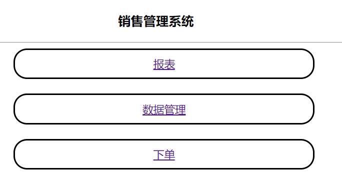
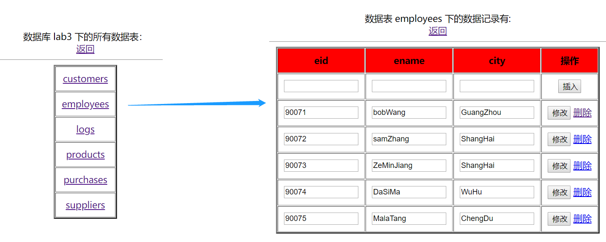
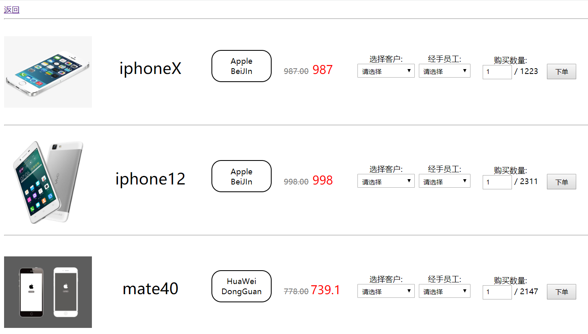
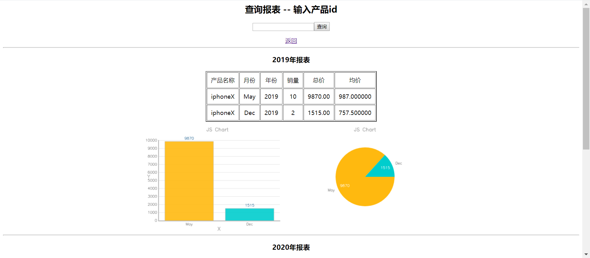
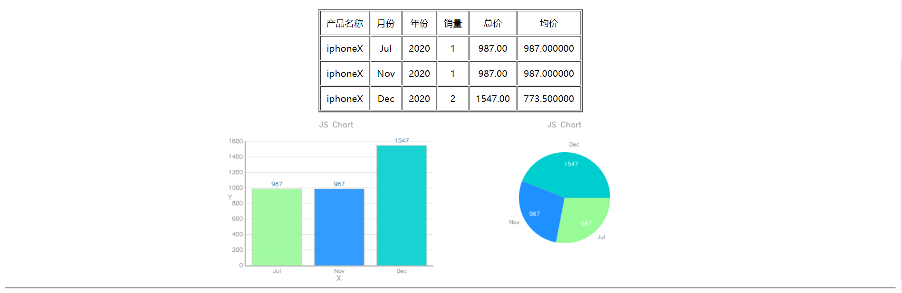

# 深大数据库系统课程 -- 实验3

这份代码写的<font color="red"><b>非常垃圾</b></font>，请谨慎食用！~~摆烂了，不写了~~

> 这 nm 是碳基生物能写出来的代码？ 
>
> ​		---- 冯诺依 · 阿克曼


## 部署

为了部署该项目，需要环境：

* 任意 web 服务器

* mysql 环境

* php 环境


配置 mysql 创建数据表，通过 `code` 目录下的 `dump.txt` 进行，你需要运行命令：

```bash
mysql -u root -p < dump.txt
```

完成配置之后，将 code 目录的所有文件，整个放到你 web 服务器的根目录，比如 `htdocs` 或者 `www` 目录，紧接着访问 localhost 的对应路径即可，好耶！


## 概览

### 主页：



<hr>

### 数据管理：



<hr>

### 下单：



<hr>

### 报表：



