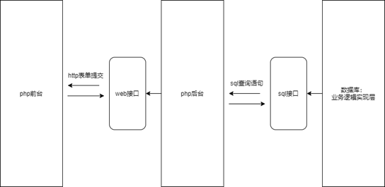
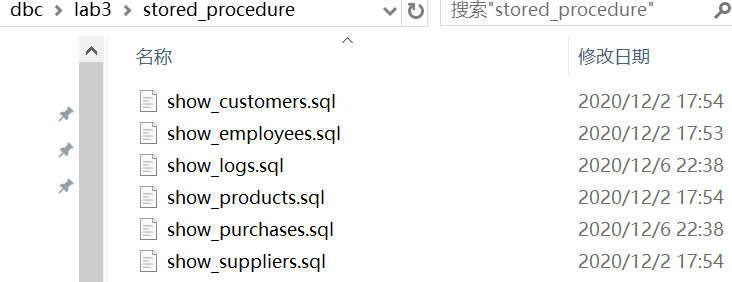
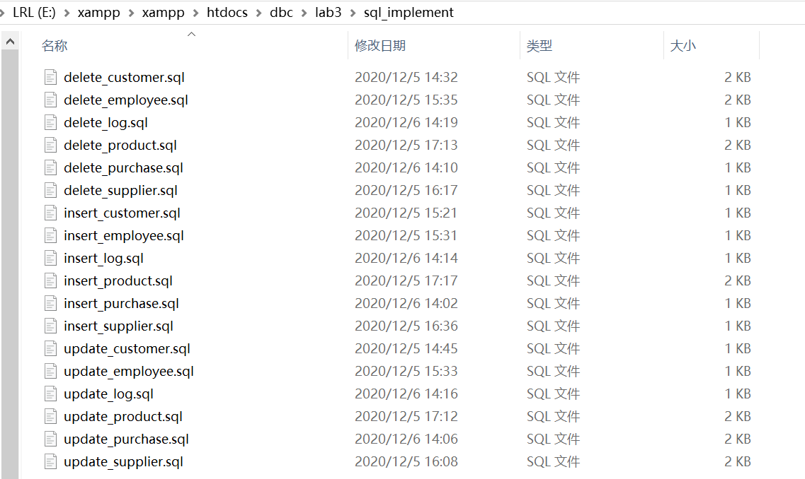
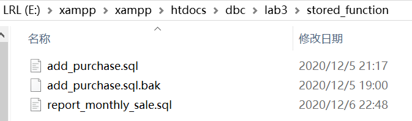
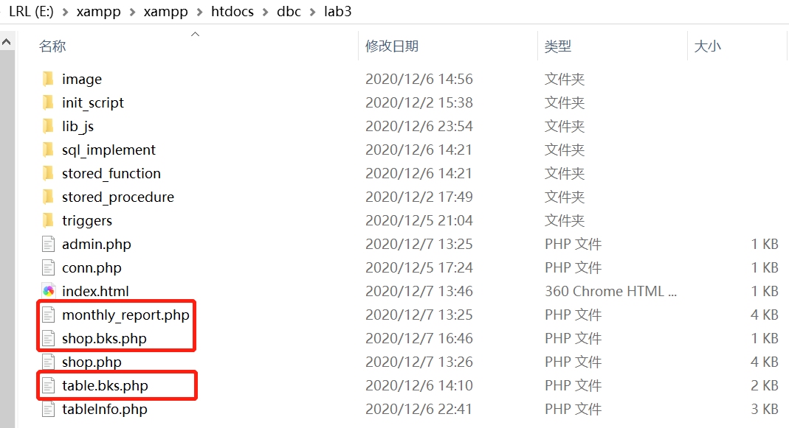
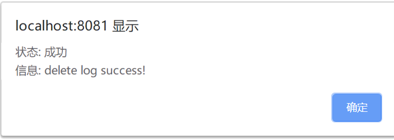
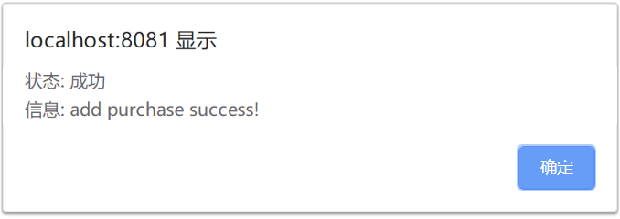

# 2018171028 李若龙 实验3 文档


# 还就内个概述



我的项目分为三个模块，其中拥有两类接口，分别是

1. sql 级别接口：通过 sql 语句调用并且拥有规范化的返回值
2. web 级别接口：通过 http 表单提交调用，有着特定化的提交参数，返回内容通常是一个定制的 web 页面


# 数据库级别的 sql 接口

首先来看 sql 接口。这些程序与事务逻辑被直接焊死在数据库中，并且暴露在外提供一些 sql 存储过程（函数）。其中这些接口又分为三大类：

1. 全表查询接口
2. 数据管理接口
3. 自定义事务接口

下面我们来细🔒每一个接口及其作用。


## 全表查询接口

全表查询接口的注册脚本，存储在项目的 stored_procedure 目录下。



我们有 6 张数据表，那么理应有 6 个全表查询接口。这些接口都以  show_ xxx 为格式。他们分别是：

| 接口名称 | 参数 | 返回值 |
| ---- | ---- |---- |
| show_customers | 无 | customers 表的所有字段 |
| show_employees | 无 | employees 表的所有字段 |
| show_logs | 无 | logs 表的所有字段 |
| show_products | 无 | products 表的所有字段 |
| show_purchases | 无 | purchases 表的所有字段 |
| show_suppliers | 无 | suppliers 表的所有字段 |


## 数据管理接口

数据管理接口的注册脚本，存储在项目目录下的 sql_implement 目录下。



这些接口涉及数据表数据的管理。我们注册了 增加，更新，删除 三种操作的接口，以规范化地管理数据。此外，这些接口的返回值都是固定的，两个字段。下面的表格给出了数据管理接口的返回值规范：
| 字段名 | 参数类型 | 解释 |
| ---- | ---- |---- |
| st | int | 操作是否成功（0 or 1） |
| msg | varchar(64) | 提示信息（比如操作为何失败） |

此外，所有的数据管理接口都以 xxxx_yyyy 命名。其中 xxxx 是操作类型，yyyy 是表名称。


### customers 表的数据管理接口

customers 表有三个数据管理接口。其中 insert_customer 和 update_customer 接口需要接收 customers 表的所有字段（请按照下文给定的顺序传输）他们分别是：

| 参数位置 | 参数类型    | 对应数据库字段名 | 解释 |
| -------- | ----------- | ---------- |---------- |
| 1 | int | cid  |顾客 id |
| 2 | varchar | cname | 顾客名称 |
| 3 | varchar | city  |顾客所在城市 |
| 4 | int | visits_made  |购买次数 |
| 5 | datetime | last_visit_time  |上次购买时间 |

示例：

```mysql
call insert_customer(1, "bob", "ShangHai", 14, 9)
```

而 delete_customer 的调用只需要一个参数，那就是要删除的顾客的 id。下面是 delete_customer 的调用示例：

```mysql
call delete_customer(1)
```


### employees 表的数据管理接口

employees 表有三个数据管理接口。其中 insert_employee 和 update_employee 接口需要接收 employees 表的所有字段（请按照下文给定的顺序传输）他们分别是：

| 参数位置 | 参数类型 | 对应数据库字段名 | 解释         |
| -------- | -------- | ---------------- | ------------ |
| 1        | int      | eid              | 员工 id      |
| 2        | varchar  | ename            | 员工名称     |
| 3        | varchar  | city             | 员工所在城市 |

示例：

```mysql
call insert_employee(1, "bob", "ShangHai")
```

而 delete_employee 的调用只需要一个参数，那就是要删除的记录的 id。下面是 delete_employee 的调用示例：

```mysql
call delete_employee(1)
```


### logs 表的数据管理接口

logs 表有三个数据管理接口。其中 insert_log 和 update_log 接口需要接收 logs 表的所有字段（请按照下文给定的顺序传输）他们分别是：

| 参数位置 | 参数类型 | 对应数据库字段名 | 解释                      |
| -------- | -------- | ---------------- | ------------------------- |
| 1        | int      | logid            | 日志 id                   |
| 2        | varchar  | who              | 执行该操作的 sql 用户名称 |
| 3        | datetime | time             | 日志记录时间              |
| 4        | varchar  | table_name       | 被操作的数据表名称        |
| 5        | varchar  | operation        | 操作                      |
| 6        | int      | key_value        | 被修改的字段主键名称      |

示例：

```mysql
call insert_log(1, "root", "2020-12-7 22:11:00", "customer", "insert", 114514)
```

>  注：
>
> 因为 logid 字段是自增的，这里**随便填**即可。为了程序一致性我们直接填上。
>
> 因为 logs 表是对客观事实的描述，所以 insert 和 update 操作**一律返回失败**。


而 delete_customer 的调用只需要一个参数，那就是要删除的记录的 id。下面是 delete_customer 的调用示例：

```mysql
call delete_log(1)
```


### products 表的数据管理接口

products 表有三个数据管理接口。其中 insert_product 和 update_product 接口需要接收 products 表的所有字段（请按照下文给定的顺序传输）他们分别是：

| 参数位置 | 参数类型     | 对应数据库字段名 | 解释         |
| -------- | ------------ | ---------------- | ------------ |
| 1        | int          | pid              | 产品 id    |
| 2        | varchar      | pname            | 产品名称   |
| 3        | int          | qoh              | 产品库存 |
| 4        | int          | qoh_threshold    | 产品库存阈值 |
| 5        | decimal(6,2) | original_price   | 原价 |
| 6        | decimal(3,2)	 | 	discnt_rate   | 折扣率 |
| 7        | int | sid   | 供应商 id |

示例：

```mysql
call insert_product(1, "RedMI note", 1000, 900, 123.45, 0.97, 50071)
```

而 delete_product 的调用只需要一个参数，那就是要删除的记录的 id。下面是 delete_product 的调用示例：

```mysql
call delete_product(1)
```


### purchases 表的数据管理接口

purchases 表有三个数据管理接口。其中 insert_purchase 和 update_purchase 接口需要接收 purchases 表的所有字段（请按照下文给定的顺序传输）他们分别是：

| 参数位置 | 参数类型     | 对应数据库字段名 | 解释        |
| -------- | ------------ | ---------------- | ----------- |
| 1        | int          | pur              | 购买记录 id |
| 2        | int          | cid              | 顾客 id     |
| 3        | int          | eid              | 经手员工 id |
| 4        | int          | pid              | 产品 id     |
| 5        | int          | qty              | 购买数量    |
| 6        | datetime     | ptime            | 购买时间    |
| 7        | decimal(7,2) | total_price      | 总价格      |

示例：

```mysql
call insert_purchase(1, 1, 1, 1, 1, "2020-1-1 10:10:00", 999.88)
```

>  注：
>
> 因为 pur 字段是自增的，这里**随便填**即可。为了程序一致性我们直接填上。
>
> 因为 purchases 购买逻辑需要特殊判断（不应该直接执行插入）故该表的 insert 操作**一律返回失败**。


而 delete_purchase 的调用只需要一个参数，那就是要删除的顾客的 id。下面是 delete_purchase 的调用示例：

```mysql
call delete_purchase(1)
```


## suppliers 表的数据管理接口

suppliers 表有三个数据管理接口。其中 insert_supplier 和 update_supplier 接口需要接收suppliers 表的所有字段（请按照下文给定的顺序传输）他们分别是：

| 参数位置 | 参数类型 | 对应数据库字段名 | 解释           |
| -------- | -------- | ---------------- | -------------- |
| 1        | int      | sid              | 供应商 id      |
| 2        | varchar  | sname            | 供应商名称     |
| 3        | varchar  | city             | 供应商所在城市 |
| 4        | char     | telephone_no     | 供应商电话     |


示例：

```mysql
call insert_supplier(1, "bob", "ShangHai", "11366558899")
```

而 delete_customer 的调用只需要一个参数，那就是要删除的顾客的 id。下面是 delete_customer 的调用示例：

```mysql
call delete_supplier(1)
```


## 自定义事务接口

自定义事务接口是向外开发的自定义事务。比如添加一条购买记录，或者查询月度报表。自定义事务接口的注册脚本，存储于项目目录下的 stored_function 目录。




### 下单接口

下单接口注册为一个名为 add_purchase.sql 的函数。其中需要的参数有：

| 参数位置 | 参数类型 | 参数名称 | 解释        |
| -------- | -------- | -------- | ----------- |
| 1        | int      | cid      | 顾客 id     |
| 2        | int      | eid      | 经手员工 id |
| 3        | int      | pid      | 产品 id     |
| 4        | int      | qty      | 购买数量    |

示例：

```mysql
call add_purchase(114, 514, 191, 10)
```


该接口的返回字段如下：

| 字段名 | 参数类型    | 解释                         |
| ------ | ----------- | ---------------------------- |
| st     | int         | 操作是否成功（0 or 1）       |
| msg    | varchar(64) | 提示信息（比如操作为何失败） |


### 报表查询接口

报表查询接口需要 1 个参数，类型为 int，表示要查询的产品的 id。报表查询接口给出 6 个字段的固定返回值，下面介绍其返回字段：

| 返回值位置 | 类型         | 索引（以数组形式查询） | 解释     |
| ---------- | ------------ | ---------------------- | -------- |
| 1          | varchar      | 0                      | 产品名称 |
| 2          | varchar      | 1                      | 月份     |
| 3          | varchar      | 2                      | 年份     |
| 4          | int          | 3                      | 销量     |
| 5          | decimal(7,2) | 4                      | 总价     |
| 6          | decimal(7,2) | 5                      | 均价     |

> 注：
>
> 返回结果是按年份 group by 之后再按照月份 group by 的


# web 级别的接口

web 级别的接口是我们页面的后台，位于项目主目录下，有三个。分别是：

1. table.bks.php，负责处理数据管理事务
2. shop.bks.php，负责处理下单请求
3. monthly_report.php，负责打印报表




事实上，php 接口只是对 sql 接口的再封装。因为我们主要的业务逻辑都写死在数据库中了。 


## 数据管理 php 接口

因为我们在 sql 级别编写的数据管理接口具有一致性，那么我们的 php 后台页面只用一个，就可以通杀。我们通过 GET 方式提交数据。其中需要前端页面传递的固定参数有两个：

| 字段名    | 参数类型 | 解释                               |
| --------- | -------- | ---------------------------------- |
| tableName | 字符串   | 操作表对象                         |
| opType    | 字符串   | 操作类型（insert, delete, update） |

然后是不定参数，需要根据 tableName 来确定。

> 注：
>
> 不定参数的意思是操作不同的表，需要传递不同的参数
>
> 事实上我们**传递该表的所有数据字段即可**。


比如我们传递一条修改 suppliers 表的请求，那么应该有如下的 GET 请求体：

| 字段名    | 参数类型 | 解释                               |
| --------- | -------- | ---------------------------------- |
| tableName | 字符串   | 操作表对象（suppliers）              |
| opType    | 字符串   | 操作类型（update） |
|sid|int|要修改的供应商 id|
|sname|varchar|供应商名称（新值）|
|city|varchar| 城市（新值）            |
|telephone_no|char|电话号码（新值）|


数据管理接口的返回值即为我们 sql 层面上数据管理接口的返回值，以 JavaScript 的 alert 命令脚本形式返回。示例：




## 下单 php 接口

下单 php 接口简单地接收四个参数，然后根据这四个参数去调用 sql 的 add_purchase 接口。下面是参数类型：

| 参数位置 | 参数类型 | 参数名称 | 解释        |
| -------- | -------- | -------- | ----------- |
| 1        | int      | cid      | 顾客 id     |
| 2        | int      | eid      | 经手员工 id |
| 3        | int      | pid      | 产品 id     |
| 4        | int      | qty      | 购买数量    |

返回值也是 sql 层面上，下单接口的返回值，以 JavaScript 的 alert 命令脚本形式返回。示例：




# 小结

业务逻辑写死在 mysql 的存储过程中了。实际上 php 接口只是简单的调用这些接口。